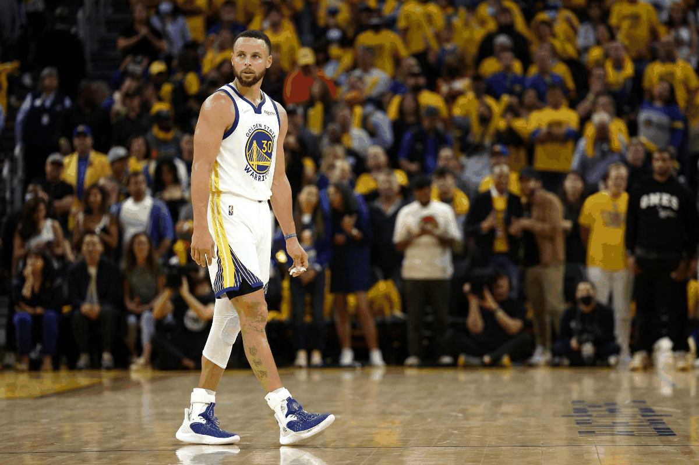
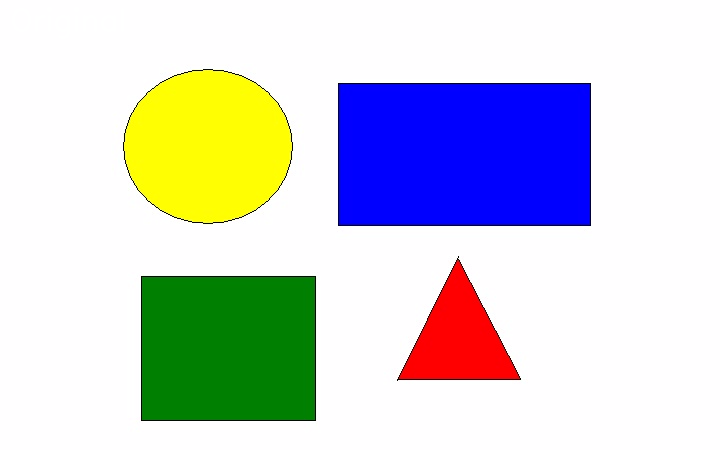
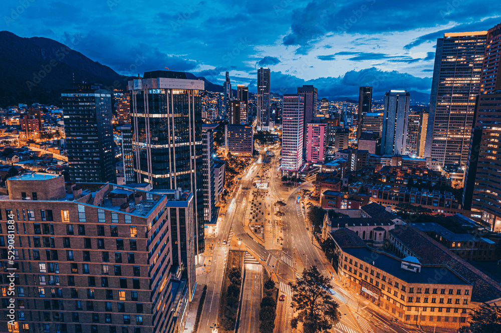
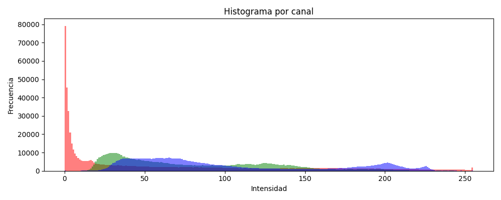

# 🎨 Taller2 - Computación Visual
**Curso:** Computación Visual  

**Autor:** Cristian David Machado Guzman

**Fecha:** 19 de Octubre de 2025  

---

## Resumen del Taller

Este taller integra los conceptos principales de la **computación visual y los gráficos 3D**, abordando desde la jerarquía de transformaciones y proyecciones hasta la percepción visual mediante filtros, bordes, segmentación y análisis de color.  
El objetivo general es **comprender cómo se combinan los procesos de visión artificial con los fundamentos de modelado y animación 3D**, aplicando transformaciones, filtrado digital, análisis de formas y manipulación de imágenes a nivel de píxel.

Los ejercicios seleccionados exploran tanto la parte **geométrica (Three.js)** como la **visual (OpenCV + NumPy)**, mostrando un panorama completo de la relación entre visión por computador y gráficos tridimensionales.

---

## Ejercicios Realizados


### Ejercicio 2 — Ojos Digitales (Filtros y Bordes con OpenCV)

**Descripción:**  
Se aplicaron filtros clásicos (blur, sharpen) y detectores de bordes (Sobel X/Y y Laplaciano) a una imagen en escala de grises para visualizar diferencias de intensidad y dirección.  
La animación muestra el flujo de percepción visual paso a paso, desde la imagen original hasta la extracción de bordes.

**GIF del resultado:**  


**Código:**  
[`19-10-2024_Taller2_cv_3d\ejercicios\02_ojos_digitales_opencv.py`](ejercicios/02_ojos_digitales_opencv.py)

**Prompts utilizados:**  
> “Genera un código en OpenCV que compare distintos filtros (blur, sharpen, Sobel X/Y y Laplaciano) y exporte un GIF con los resultados.”

**Aprendizaje:**  
Los bordes resaltados por Sobel y Laplaciano permiten entender cómo las máquinas interpretan los contornos. Me ayudó a visualizar claramente cómo los filtros afectan el contraste y la detección de detalles.

---

### Ejercicio 3 — Segmentando el Mundo (Binarización y Contornos)

**Descripción:**  
Mediante técnicas de **umbralización fija** y `findContours`, se segmentaron las formas principales de una imagen binaria y se calcularon métricas geométricas como área, perímetro y centroides.  
La animación muestra la progresión desde la imagen original hasta los contornos detectados con etiquetas.

**GIF del resultado:**  


**Código:**  
[`/Ejercicio3_segmentacion/ejercicio3.py`](ejercicios/03_segmentacion_umbral_contornos.py)

**Aprendizaje:**  
Pude entender cómo los momentos geométricos permiten encontrar centroides y calcular medidas sin depender de modelos preentrenados. El reto fue ajustar el umbral correcto para que los bordes fueran detectados limpiamente.

---

### Ejercicio 4 — Explorando el Color (Modelos RGB, HSV y Lab)

**Descripción:**  
Se exploraron distintos **modelos de color** (RGB, HSV, LAB) y se realizaron simulaciones visuales de daltonismo y condiciones de baja iluminación.  
El objetivo fue comprender cómo la percepción del color cambia según el modelo o la alteración aplicada.

**GIF del resultado:**  


**Histograma**


**Código:**  
[`/Ejercicio4_color/ejercicio4.py`](ejercicios/04_imagen_matriz_pixeles.py)

**Aprendizaje:**  
Visualizar los canales HSV y LAB me permitió comprender por qué estos modelos son más adecuados para tareas de segmentación o visión artificial que el RGB. Aprendí además a manipular matrices de color directamente con NumPy.

## 📁 Estructura del proyecto

```
19-10-2024_Taller2_cv_3d/
│
├── assets/
│   ├── Ejercicio2.jpg
│   ├── Ejercicio3.png
│   ├── Ejercicio4.jpg
│   └── Ejercicio10.jpeg
│
├── ejercicios/
│   ├── 02_ojos_digitales_opencv.py
│   ├── 03_segmentacion_umbral_contornos.py
│   ├── 04_imagen_matriz_pixeles.py
│   └── 10_modelos_color_percepcion.py
│
├── gifs/
│   ├── Ejercicio2_comparacion.gif
│   ├── Ejercicio3_segmentacion.gif
│   ├── Ejercicio4_comparacion.gif
│   ├── Ejercicio10_comparacion.gif
│   └── (archivos .png de comparación)
│
└── README.md
```

---

## ⚙️ Dependencias y Ejecución

### 🧰 Requisitos generales (Python)
```bash
pip install opencv-python numpy matplotlib pillow
```

### ▶️ Ejecución de cada ejercicio
```bash
python ejercicios/02_ojos_digitales_opencv.py
python ejercicios/03_segmentacion_umbral_contornos.py
python ejercicios/04_imagen_matriz_pixeles.py
python ejercicios/10_modelos_color_percepcion.py
```


