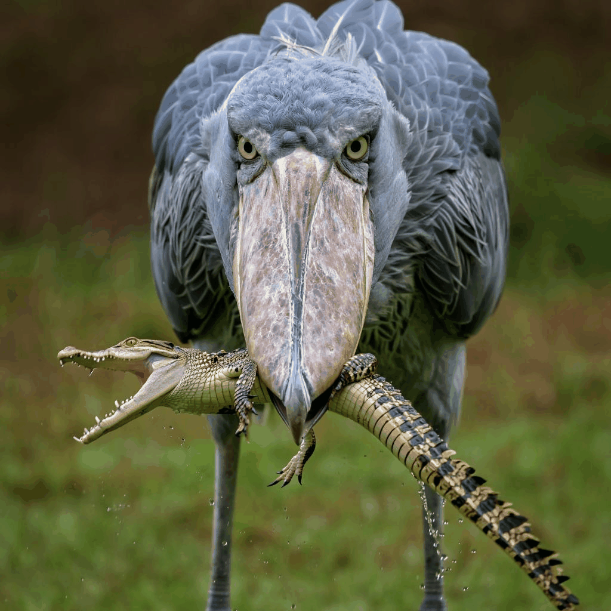
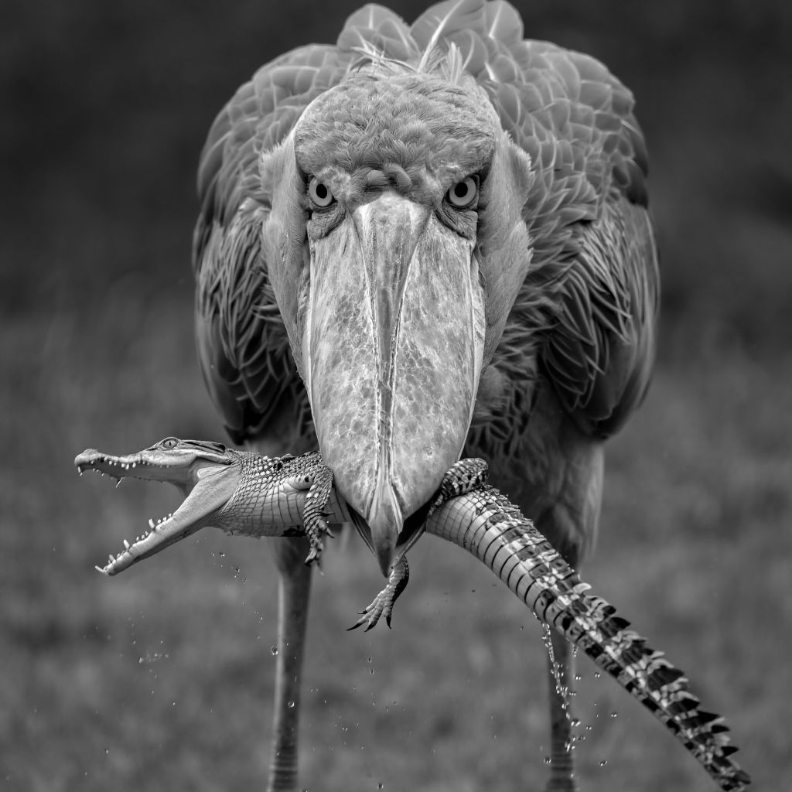
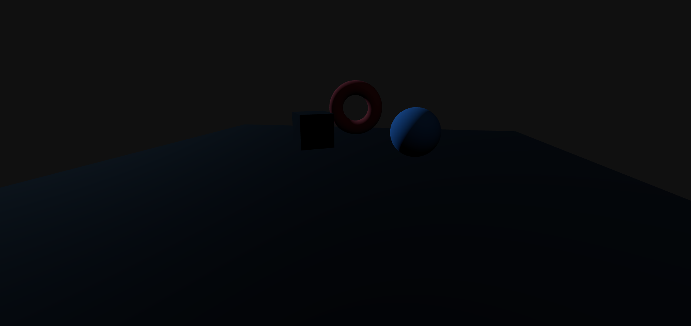
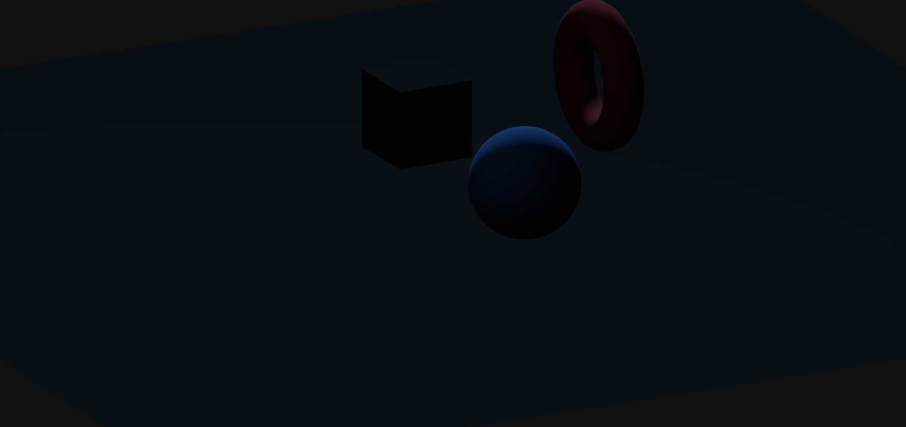
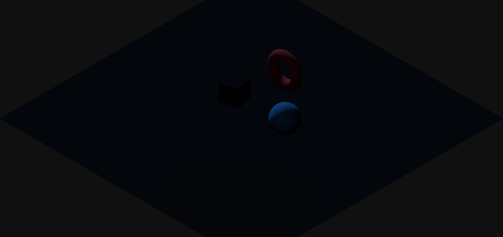

# Examen Final: Computación Visual y Gráficos 3D
#### Cristian David Machado Guzman
Este repositorio contiene los entregables del examen final, divididos en dos puntos principales: Procesamiento de Imágenes con Python y una Escena 3D interactiva con Three.js.

## Punto 1 – Procesamiento de Imágenes en Python

### GIFs de Demostración

#### GIF 1: Filtros y Canales

Muestra la carga, el suavizado, el realce de bordes y la separación de canales RGB.

#### GIF 2: Operaciones Morfológicas

Muestra la imagen binarizada, la aplicación de la Erosión y la Dilatación.

Explicación Breve

La implementación de este punto se basó en la librería OpenCV para la manipulación de la imagen de un Tigre de Bengala (especie en peligro).

Se aplicaron dos filtros básicos: el filtro Gaussiano para el suavizado, que reduce el ruido y el detalle al promediar los píxeles vecinos, y el filtro de Laplaciano para el realce de bordes, el cual detecta cambios bruscos de intensidad, destacando las rayas del tigre.

En cuanto a las operaciones morfológicas, se trabajó sobre una imagen binarizada: la Erosión redujo el área de las rayas blancas (objetos de primer plano) y adelgazó sus contornos, mientras que la Dilatación aumentó el área de estas mismas regiones, haciendo las rayas más gruesas, logrando así un análisis del grosor de las estructuras.

### Gif completo

## Punto 2 – Three.js

### Ejecución del Proyecto

El proyecto está configurado con Vite. Asumiendo que la estructura de carpetas está en la raíz threejs/:

Abre la terminal en la carpeta raíz threejs/ (donde se encuentran package.json y vite.config.js).

Instala las dependencias: npm install

Inicia el servidor de desarrollo: npm run dev

Abre la URL proporcionada por Vite (generalmente http://localhost:5173/).

### GIFs de Demostración

#### GIF 3: Animación y Rotación con OrbitControls

Muestra el movimiento continuo de las figuras y la rotación manual de la cámara.

#### GIF 4: Zoom con OrbitControls

Muestra la capacidad de acercar y alejar la cámara.

#### GIF 5: Cambio de Perspectiva

Muestra la escena alternando entre la cámara Perspectiva y la cámara Ortográfica mediante el botón.

### Implementación Técnica

#### Cambio de Perspectiva

Se implementaron dos instancias de cámara: camPersp (THREE.PerspectiveCamera) y camOrtho (THREE.OrthographicCamera). La variable activeCam mantiene la referencia a la cámara actual. El botón "Cambiar Cámara" (btnCam) ejecuta una función que alterna entre camPersp y camOrtho. Es crucial que, al cambiar, se actualice la propiedad controls.object = activeCam; para que OrbitControls siga a la cámara correcta.

#### Animaciones

La animación se logra mediante un bucle de render (function animate(){ requestAnimationFrame(animate); ... }). Dentro de este bucle, se aplican incrementos constantes a las propiedades de rotación (rotation.y, rotation.x, rotation.z) de las figuras (cubo, esfera, toro). Esto genera un movimiento continuo y fluido.

#### Texturas

Se aplicaron dos texturas a través del THREE.TextureLoader: una textura de mármol al plano del suelo y una textura de metal al cubo. Para que el mármol se viera correctamente en el plano grande, se configuró tex_piso.repeat.set(8, 8) y THREE.RepeatWrapping para el UV mapping. La iluminación se maneja con una PointLight (luz puntual) y una DirectionalLight (luz direccional).

#### OrbitControls

Se inicializaron los controles con const controls = new OrbitControls(activeCam, renderer.domElement);. Para permitir la rotación (clic izquierdo y arrastrar) y el zoom (rueda del ratón), el método controls.update() se llama en cada frame dentro del bucle animate(), asegurando la interactividad continua con el usuario.